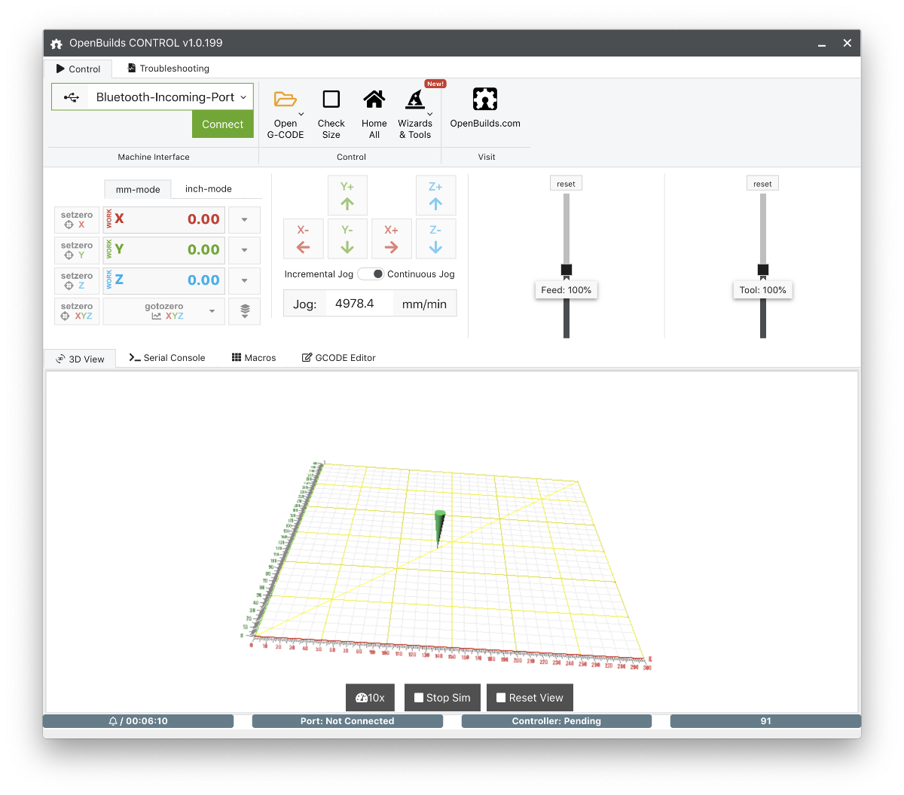
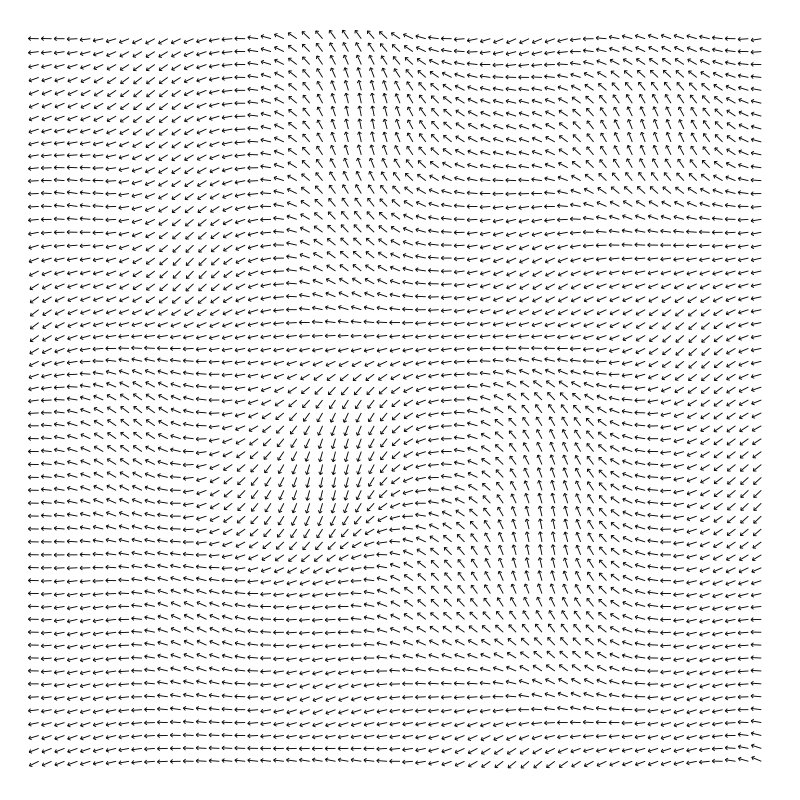

# Plotter code

A collection of simple code for playing around with my OpenBuilds Acro 55 plotter / laser engraver.

## Plotter hardware

* OpenBuilds ACRO 55 20" x 20" (https://openbuildspartstore.com/openbuilds-acro-55-20-x-20/)
* BlackBox Motion Control System (https://openbuildspartstore.com/blackbox-motion-control-system/)
* Pen lifter: EleksMaker® Draw Module XY Plotter
* Laser: 450nm 3.5W Blue Laser Module TTL Modulation Fan Heat Sink for EleksMaker DIY Engraver 

## Software & grbl settings

I'm sending simple gcode to the "OpenBuilds CONTROL Machine Interface Controller" https://software.openbuilds.com/ 

The plotter pen is raised and dropped by controlling an RC servo. To use the system as a plotter, I first flashed my Blackbox motion controller with the "2 Axes + RC servo" machine style image found in the grbl flashing tool within OpenBuilds CONTROL. Then, the M3 command can be used to send out varying PWM signals to the RC servo. The settings that worked for me:

* Laser-mode ($32): disabled
* Maximum spindle speed, RPM ($30): 1000
* Minimum spindle speed, RPM ($31): 0

Note: For laser engraving, I bought "LightBurn" (https://lightburnsoftware.com/), which does an excellent job when importing vector or raster images and turning them into an engraving. It's not too convenient when using it for controlling the system when the plotter pen is installed, as it's optimized for laser systems.


## placement_grid.py

A simple script that creates gcode for drawing a rectilinear grid onto my plotter bed

Example:

Draw a 50mm-spaced grid for a 300mm x 300mm plotter bed:

```
python placement_grid.py 300 300 50 -v -o gcode_grid_300x300-50.gcode
```

The gcode file "gcode_grid_300x300-50.gcode" can then be opened in the OpenBuilds CONTROL software.

For options, type:

```
python placement_grid.py -h
```




## Perlin noise field

Script: perlin_noise_arrows.py
Subfolder: perlin_noise_field

A script to create 2D field of arrows, oriented using Perlin noise. (Uses: https://github.com/caseman/noise) 

It creates an SVG file, as well as a gcode file that describes the arrows. Here's a 30x30 example with default noise settings:




