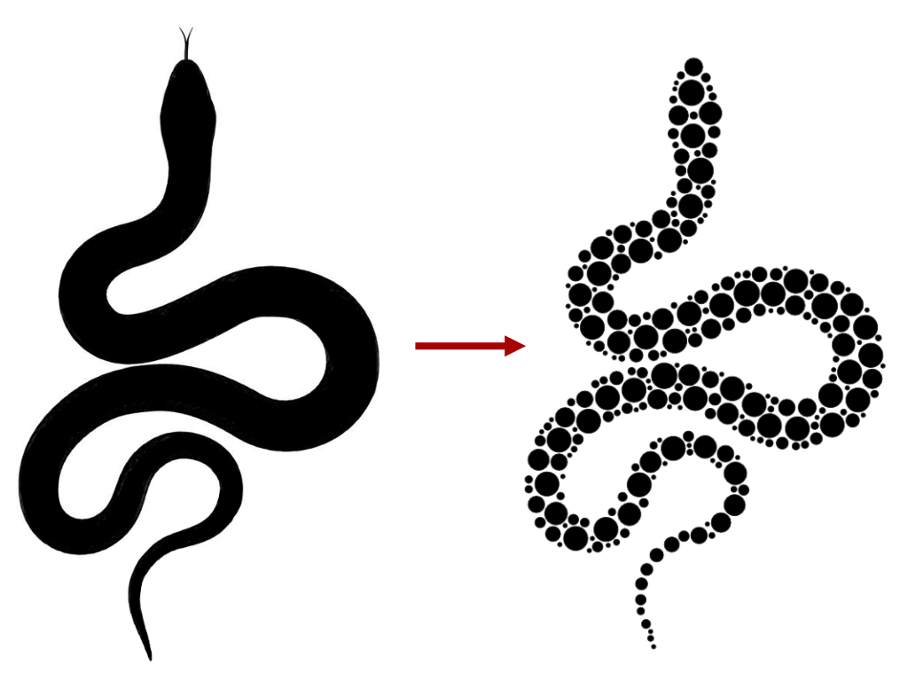
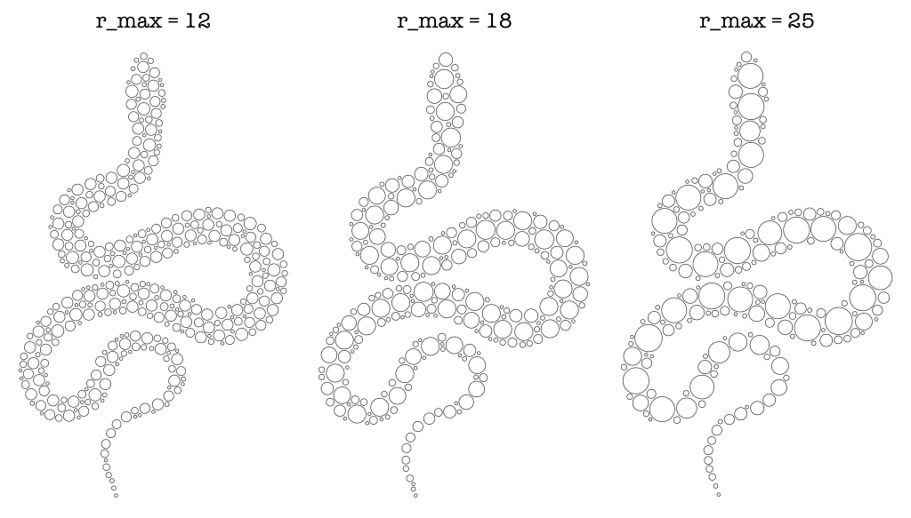
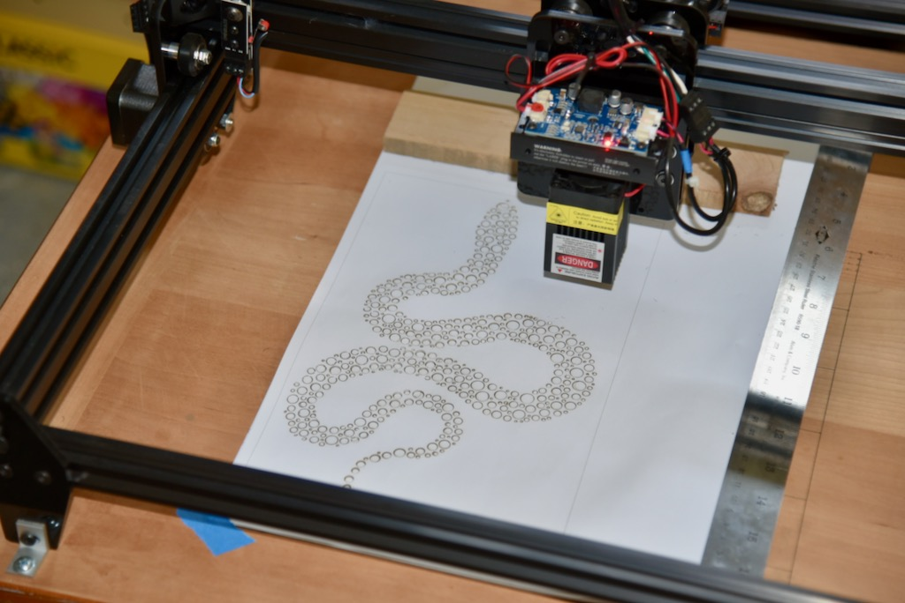
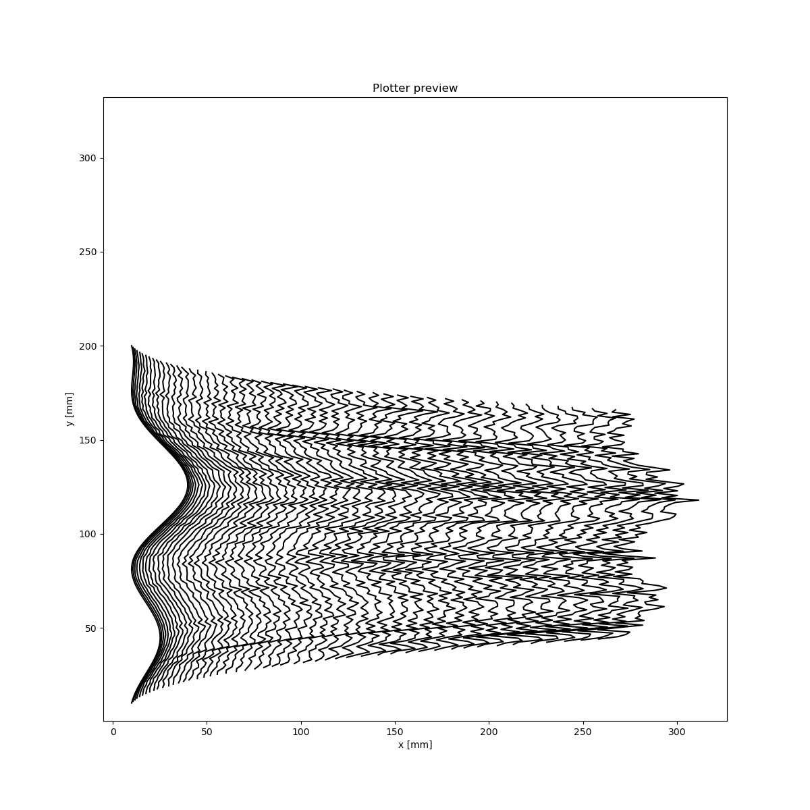

# Plotter code

A collection of simple code for playing around with my OpenBuilds Acro 55 plotter / laser engraver. This repository serves as my notebook so I can set up the system again when needed.

## Plotter hardware

* OpenBuilds ACRO 55 20" x 20" (https://openbuildspartstore.com/openbuilds-acro-55-20-x-20/)
* BlackBox Motion Control System (https://openbuildspartstore.com/blackbox-motion-control-system/)
* Pen lifter: EleksMaker® Draw Module XY Plotter
* Laser: 450nm 3.5W Blue Laser Module TTL Modulation Fan Heat Sink for EleksMaker DIY Engraver 

## Software & grbl settings

I'm sending simple gcode to the "OpenBuilds CONTROL Machine Interface Controller" https://software.openbuilds.com/ 

The plotter pen is raised and dropped by controlling an RC servo. To use the system as a plotter, I first flashed my Blackbox motion controller with the "2 Axes + RC servo" machine style image found in the grbl flashing tool within OpenBuilds CONTROL. Then, the M3 command can be used to send out varying PWM signals to the RC servo. The settings that worked for me:

* Laser-mode ($32): disabled
* Maximum spindle speed, RPM ($30): 1000
* Minimum spindle speed, RPM ($31): 0

**Note:** For laser engraving, I bought "LightBurn" (https://lightburnsoftware.com/), which does an excellent job when importing vector or raster images and turning them into an engraving. It's not too convenient when using it for controlling the system when the plotter pen is installed, as it's optimized for laser systems.


## placement_grid.py

A simple script that creates gcode for drawing a rectilinear grid onto my plotter bed. Useful for lining up paper.

Example:

Draw a 50mm-spaced grid for a 300mm x 300mm plotter bed:

```
python placement_grid.py 300 300 50 -v -o gcode_grid_300x300-50.gcode
```

The gcode file "gcode_grid_300x300-50.gcode" can then be opened in the OpenBuilds CONTROL software.

For options, type:

```
python placement_grid.py -h
```
Here's how the grid looks like in the OpenBuilds Control software GUI:


## Perlin noise field

**Script:** perlin_noise_arrows.py
**Subfolder:** perlin_noise_field

A script to create 2D field of arrows, oriented using Perlin noise. (Uses: https://github.com/caseman/noise) 

It depends on the following modules:

* svgwrite ('https://github.com/mozman/svgwrite)

* noise (https://github.com/caseman/noise)

  It creates an SVG file, as well as a gcode file that describes the arrows. Here's a 30x30 example with default noise settings:


### Help output

```bash
usage: perlin_noise_arrows.py [-h] [--offset OFFSET OFFSET] [--border BORDER]
                              [-s0 G0_SPEED] [-s1 G1_SPEED] [--pen_up PEN_UP]
                              [--pen_down PEN_DOWN] [-n NOISE_PARAMS]
                              [-a ARROW_PARAMS] [--rect_only]
                              width height stepsize

Make a field of arrows either as an SVG image, or in gcode. Units are mm.

positional arguments:
  width                 Width of bed (mm)
  height                Height of bed (mm)
  stepsize              Stepsize, i.e. distance between arrows. (mm).

optional arguments:
  -h, --help            show this help message and exit
  --offset OFFSET OFFSET
                        Offset from origin
  --border BORDER       Border for bounding box rectangle.
  -s0 G0_SPEED, --g0_speed G0_SPEED
                        Speed in mm/min for G0 command (fast placement)
  -s1 G1_SPEED, --g1_speed G1_SPEED
                        Speed in mm/min for G1 command (pen movement)
  --pen_up PEN_UP       GCode for Pen Up movement.
  --pen_down PEN_DOWN   GCode for Pen Down movement.
  -n NOISE_PARAMS, --noise_params NOISE_PARAMS
                        Parameters for Perlin noise, separated by a pipe
                        character. Parameters: p,s{pnoise or
                        snoise}|octaves|persistence|lacunarity|z (rand, or an
                        integer|repeat x|repeat y
  -a ARROW_PARAMS, --arrow_params ARROW_PARAMS
                        Parameters for arrows, each separated by a pipe
                        character. Parameters: length|tiplength|rel
  --rect_only           Only draw rectangle, not arrows
```


## Packing Circles
[OpenCV]: https://opencv.org/

Code to place circles of varying radii onto a binary image mask. Depends on OpenCV  (cv2 module in Python). Below is an example of a mask image of a snake, converted to a pattern of circles, which is exported as an SVG vector image:




The command that produced the pattern is as follows:

```bash
python pack_circles.py masks/mask-snake.png -m 200 -n 1000 --r_min 3 --r_max 18 --offset 2 -i -o snake.svg
```


- -n ... number of circles that the script attempts to place
- -m ... number of attempts when placing a circle. 1000 in this example
- --r_min ... smallest circle radius in pixels
- --r_max ... largest circle radius in pixels
- --offset ... minimum number of pixels between two circles (default = 0)
- -i ... invert the mask, so that circles are placed on black areas. By default, circles are drawn on white areas
- -v ... be more verbose when running the command (for debugging)


Here is an example where r_min was set to 3, but r_max was changed from 12, to 18, to 25:




### Example of laser-cut stencil:

 It takes about 10 minutes to cut the paper stencil on my wimpy laser engraver, but it turned out nice. I added an offset of 3 to make sure the paper stays strong, and connections between circles don't break too easily. Pattern command:

```bash
pack_circles.py masks/mask_snake.png -i -n 1000 --r_min 2 --r_max 12 --offset 3 -m 150 -o snake_template.svg
```





### Algorithm

The script first finds allowable pixels to place circles. It then randomly picks an allowed coordinate and places circle $i$ with radius $r_i$, as long as $i < n$.  It checks two conditions:

1. Circle must fit within the mask (uses OpenCV)
2. Circle must not overlap any previously placed one

If any of these two conditions fails, a new coordinate is picked and another attempt is made. (It gives up after m attempts.) 

**Note:** This is a fairly dumb algorithm, so it gets very slow when trying to place more than a 1000 points or so, depending on how small and crowded the mask is. I tried adding an update mechanism to remove already placed circles from the mask (-u, --update option), but it doesn't seem to speed things up at all. Maybe not checking *all* other circles for overlap, but just near ones (which should be might help speed things up too, but I didn't have a need for any further optimization.


### Help output

```bash
usage: pack_circles.py [-h] [-o OUTPUT] [-n N_POINTS] [--r_min R_MIN]
                       [--r_max R_MAX] [-m MAX_ATTEMPTS] [--offset OFFSET]
                       [-u] [-i] [-v]
                       input

positional arguments:
  input                 Input mask file. (Binary PNG: white and black areas.)

optional arguments:
  -h, --help            show this help message and exit
  -o OUTPUT, --output OUTPUT
                        Output file name (.svg)
  -n N_POINTS, --n_points N_POINTS
                        How many circles to draw (attempt)
  --r_min R_MIN         Minimum radius
  --r_max R_MAX         Maximum radius
  -m MAX_ATTEMPTS, --max_attempts MAX_ATTEMPTS
                        How many attempts when placing each circle.
  --offset OFFSET       Extra pixel distance between circles.
  -u, --update          Update mask from time to time to remove areas with
                        already placed circles.
  -i, --invert          Invert the mask so that circles are painted on black
                        areas.
  -v, --verbose         Be extra verbose when running the program.
```


## Offset lines

The subfolder `offset_lines` contains some brief test code that shows how to use the svg-to-gcode library (https://pypi.org/project/svg-to-gcode/) to create gcode.


The `CustomPenPlotterInterface()` class is a custom interface for my Acro 55, using a servo-controlled pen holder. Lines are created from `svg_to_gcode.geometry` objects and then compiled to gcode using an instance of `svg_to_gcode.compiler.Compiler`.


